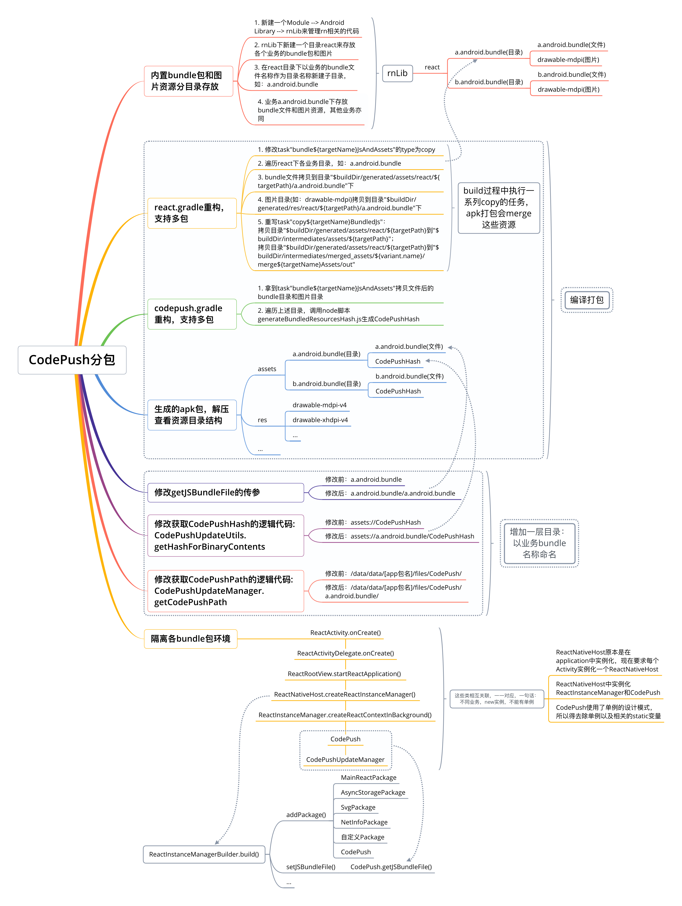

# CodePush支持多包——加载不同业务的bundle包

## 背景
前期由于对CodePush的预研不足，以为支持多包热更新，结果在实际应用中发现CodePush拿的热更新bundle资源是没有区分业务的，导致切换业务场景的时候出现白屏现象，所以需要对CodePush源码进行重构。

fork了[https://github.com/microsoft/react-native-code-push](https://github.com/microsoft/react-native-code-push)，并提交了重构后的代码：[https://github.com/hsl5430/react-native-code-push](https://github.com/hsl5430/react-native-code-push)


## 修改记录
| 日期           | 说明    |建议React Native版本 |
| ----------------------- | ---------------------------- | ---------------------------- |
| 2021-03-12    | 同步更新 [https://github.com/microsoft/react-native-code-push](https://github.com/microsoft/react-native-code-push) 最新代码v7.0.0 | v0.63.4(支持Androidx) |
| 2019-09-06    | 提交文档等 |
| 2019-08-06    | fork [https://github.com/microsoft/react-native-code-push](https://github.com/microsoft/react-native-code-push) v5.6.1，并重构 | v0.59.10(不支持Androidx的最后一个版本) |


## 申明
- 下文均以**\[reactProject\]**标识react native项目根目录
- react native简称rn
- react native版本：0.63.4
- CodePush版本：7.0.0
- 未升级Androidx的项目可以`git checkout 670620a54d05c50464d195eecc061af07a4ccf8d`，对应react native版本：0.59.10，CodePush版本：5.6.1

***

在讲CodePush重构前需要先讲讲几个重点：

## 关于react.gradle
**路径**：[reactProject]/node_modules/react-native/react.gradle

在[reactProject]/android/app/build.gradle中，依赖了react.gradle

```java
apply from: "../../node_modules/react-native/react.gradle"
```
这个gradle脚本主要做了些什么呢？其实就是创建了2个task，在app构建过程中生成bundle文件和相关的资源文件（图片等）。
### bundle${targetName}JsAndAssets
```java
def currentBundleTask = tasks.create(
    name: "bundle${targetName}JsAndAssets",
    type: Exec) {
    group = "react"
    description = "bundle JS and assets for ${targetName}."
    ...
}
```
调用node脚本

```java
commandLine(*nodeExecutableAndArgs, cliPath, bundleCommand, "--platform", "android", "--dev", "${devEnabled}",
                    "--reset-cache", "--entry-file", entryFile, "--bundle-output", jsBundleFile, "--assets-dest", resourcesDir, *extraArgs)
```
生成bundle文件到

```java
file("$buildDir/generated/assets/react/${targetPath}")
```
生成资源文件到

```java
file("$buildDir/generated/res/react/${targetPath}")
```

### copy${targetName}BundledJs

```java
def currentAssetsCopyTask = tasks.create(
    name: "copy${targetName}BundledJs",
    type: Copy) {
    group = "react"
    description = "copy bundled JS into ${targetName}."
    ...
}
```
拷贝bundle文件到`$buildDir/intermediates/assets/${targetPath}`和`$buildDir/intermediates/merged_assets/${variant.name}/merge${targetName}Assets/out
`

Android项目在构建过程中mergeAssets的时候，会将该目录下的bundle文件打包到assets目录下。

所以，如果你是直接通过node脚本生成bundle包，或者由别的开发人员将生成好的bundle包给你，并放在[reactProject]/android/app/src/main/assets下，其实可以不用依赖react.gradle，就不用每次在build过程中起跑上述这两个task

## 关于codepush.gradle
**路径**：[reactProject]/node_modules/react-native-code-push/android/codepush.gradle

在[reactProject]/android/app/build.gradle中，依赖了codepush.gradle

```java
apply from: "../../node_modules/react-native-code-push/android/codepush.gradle"
```
这个gradle脚本主要做了些什么呢？

### 记录apk文件的构建时间
```java
gradle.projectsEvaluated {
    android.buildTypes.each {
        // to prevent incorrect long value restoration from strings.xml we need to wrap it with double quotes
        // https://github.com/microsoft/cordova-plugin-code-push/issues/264
        it.resValue 'string', "CODE_PUSH_APK_BUILD_TIME", String.format("\"%d\"", System.currentTimeMillis())
    }
    ...
}
```
起初我在接入CodePush的时候，没有依赖codepush.gradle，也不报错，结果跑起来后，直接崩溃了，跟踪下源码发现CodePush在下载更新包downloadUpdate的时候，调用了getBinaryResourcesModifiedTime

```java
long getBinaryResourcesModifiedTime() {
    try {
        String packageName = this.mContext.getPackageName();
        int codePushApkBuildTimeId = this.mContext.getResources().getIdentifier(CodePushConstants.CODE_PUSH_APK_BUILD_TIME_KEY, "string", packageName);
        // replace double quotes needed for correct restoration of long value from strings.xml
        // https://github.com/microsoft/cordova-plugin-code-push/issues/264
        String codePushApkBuildTime = this.mContext.getResources().getString(codePushApkBuildTimeId).replaceAll("\"", "");
        return Long.parseLong(codePushApkBuildTime);
    } catch (Exception e) {
        throw new CodePushUnknownException("Error in getting binary resources modified time", e);
    }
}
```
很显然，拿不到`CODE_PUSH_APK_BUILD_TIME`就直接崩了。

### 生成CodePushHash
```java
def generateBundledResourcesHash = tasks.create(
        name: "generateBundledResourcesHash${targetName}",
        type: Exec) {
    commandLine (*nodeExecutableAndArgs, "${nodeModulesPath}/react-native-code-push/scripts/generateBundledResourcesHash.js", resourcesDir, jsBundleFile, jsBundleDir)
    enabled config."bundleIn${targetName}" ||
    config."bundleIn${variant.buildType.name.capitalize()}" ?:
    targetName.toLowerCase().contains("release")
}
```
调用node脚本`generateBundledResourcesHash.js`（**有兴趣的童鞋可以深挖hash是怎么生成的**），传入bundle包和对应的图片等资源文件，生成对应的hash，并以文件的形式存储这个hash，存储在[reactProject]/android/app/build/generated/assets/react/debug/CodePushHash

```java
[reactProject]/android/app/build/generated/assets/react/debug
 ├── CodePushHash
 └── index.android.bundle
```
同上，起初接入CodePush的时候，没有依赖codepush.gradle，也不报错，结果跑起来后，logcat下打印了一条日志

```java
Unable to get the hash of the binary's bundled resources - "codepush.gradle" may have not been added to the build definition.
```
定位到CodePush源码

```java
public static String getHashForBinaryContents(Context context, boolean isDebugMode) {
    try {
        return CodePushUtils.getStringFromInputStream(context.getAssets().open(CodePushConstants.CODE_PUSH_HASH_FILE_NAME));
    } catch (IOException e) {
        try {
            return CodePushUtils.getStringFromInputStream(context.getAssets().open(CodePushConstants.CODE_PUSH_OLD_HASH_FILE_NAME));
        } catch (IOException ex) {
            if (!isDebugMode) {
                // Only print this message in "Release" mode. In "Debug", we may not have the
                // hash if the build skips bundling the files.
                CodePushUtils.log("Unable to get the hash of the binary's bundled resources - \"codepush.gradle\" may have not been added to the build definition.");
            }
        }
        return null;
    }
}
```
这个是react获取bundle包资源信息的一部分，具体react层拿到这个hash做什么，我没有去深挖。

总之，既然接入CodePush，必然要按照文档要求，依赖codepush.gradle，保证能正常记录apk文件的构建时间和生成CodePushHash。

## 关于目录结构
### **内置**bundle包和图片资源的路径

```java
src
 └─ main
     ├─ assets
     │   └─ index.android.bundle
     └─ res
         ├─ drawable-mdpi
         │   ├─ ic_back.png
         │   └─ ...
         ├─ drawable-xhdpi
         │   ├─ ic_back.png
         │   └─ ...
         └─ ...
```
### **CodePush热更新**bundle包和图片资源的路径

```java
/data/data/[应用包名]/files
 └─ CodePush
     ├─ codepush.json // 记录当前热更新资源包的一些已基本信息
     ├─ [hash]
     │   ├─ app.json // 记录本hash对应热更新资源包的一些已基本信息
     │   └─ [version] // 这里的version是CodePush定义的热更新版本号，非APP版本号
     │       ├─ index.android.bundle
     │       ├─ drawable-mdpi
     │       │   ├─ ic_back.png
     │       │   └─ ...
     │       ├─ drawable-xhdpi
     │       │   ├─ ic_back.png
     │       │   └─ ...
     │       └─ ...
     ├─ [hash2]
     └─ ...
```
`CodePush.getJSBundleFile("index.android.bundle")`在读取名称为index.android.bundle的bundle包时，会先拿热更新bundle包，如果没有，便取内置bundle包。具体可查看方法`CodePush.getJSBundleFileInternal(String assetsBundleFileName)`

***

## 为何说CodePush不支持多业务多包
- react.gradle、codepush.gradle的实现都是针对单个bundle包的
- assets目录下看似可以放多个不同名称的bundle包，但生成的CodePushHash文件是跟bundle包放在同一目录下的，即放在assets目录下，文件名称定死了，就是"CodePushHash"，没法做到一个bundle文件对应一个CodePushHash文件
- 热更新，CodePush目录下以hash值作为文件夹区分不同的热更新包，但因为没有区分业务，这就意味着找热更新包的时候找错。我们在开发中就踩坑了，A页面（AActivity）加载内置在assets下的a.android.bundle，同时下载了热更新（支持强制更新和下次进入页面应用更新），再访问B页面（BActivity）加载内置在assets下的b.android.bundle，同时下载了热更新，再访问A页面，结果加载到B页面的热更新，页面白屏了。简而言之，就是应用了最后一次下载的热更新资源。

 ```java
String jsBundleFile = CodePush.getJSBundleFile("a.android.bundle");
Log.d(“JSBundleFile”, jsBundleFile);
// 比如这里Log出来的值：/data/data/com.react.demo/files/CodePush/4247860b1dc848a13e6c980ac9bee9323de4210951ea917bc68f7346575370e2/1.0.0/b.android.bundle

 ```

所以，要支持多业务多包，必须要将各业务的react native环境和codepush环境隔离，保证互不影响。

***

## 一步一步实现CodePush分包
先上一个思维导图


### 一、工程目录管理
内置bundle包和图片资源分目录存放

1. 新建一个Module --> Android Library --> rnLib来管理rn相关的代码
2. rnLib下新建一个目录react来存放各个业务的bundle包和图片
3. 在react目录下以业务的bundle文件名称作为目录名称新建子目录，如：a.android.bundle
4. 业务a.android.bundle下存放bundle文件和图片资源，其他业务亦同

 ```java
rnLib
 └─ react
     ├─ a.android.bundle(目录)
     │   ├─ a.android.bundle(文件)
     │   ├─ drawable-mdpi
     │   │   ├─ a_ic_back.png // 图片的命名建议区分业务，不同业务不要出现名称相同的图片，
     │   │   └─ ...           // 否则apk打包的时候，会报资源合并冲突的错误
     │   └─ ...
     └─ b.android.bundle(目录)
         ├─ b.android.bundle(文件)
         ├─ drawable-mdpi
         │   ├─ b_ic_back.png
         │   └─ ...
         └─ ...

 ```
这么做，主要是为了方便管理这些rn资源

### 二、编译打包处理
基于上述目录结构，重构**react.gradle**和**codepush.gradle**脚本

#### react.gradle重构，支持多包
上文在rnLib下建的react目录，它不像assets、res等预置目录目录，能被Android工程所识别，在打包过程中打到apk文件中，所以这里利用**react.gradle**，拷贝react目录下的文件到build目录下特定的目录，能被Android工程所识别。重构后的代码：

```java
/*
* 重写/node_modules/react-native/react.gradle的实现逻辑:
* 支持多业务分包方案, /react目录下以业务bundle名称作为文件夹名称来存放各个业务的bundle文件合关联的资源文件
* */
def config = project.hasProperty("react") ? project.react : []

def reactRoot = file(config.root ?: "../../")
def inputExcludes = config.inputExcludes ?: ["android/**", "ios/**"]

// React js bundle directories
def jsBundleAndResDir = file("$rootDir/rnLib/react")
def generatedDir = "$buildDir/generated"

afterEvaluate {

    def isAndroidLibrary = plugins.hasPlugin("com.android.library")
    def variants = isAndroidLibrary ? android.libraryVariants : android.applicationVariants
    variants.all { def variant ->
        // Create variant and target names
        def targetName = variant.name.capitalize()
        def targetPath = variant.dirName

        def jsBundleRootDir = file("$generatedDir/assets/react/${targetPath}")

        // 遍历jsBundleAndResDir下的各个业务
        ArrayList<File> sources = new ArrayList<>()
        ArrayList<File> jsBundleDirs = new ArrayList<>()
        ArrayList<File> resourcesDirs = new ArrayList<>()
        files(jsBundleAndResDir.listFiles(new FilenameFilter() {
            @Override
            boolean accept(File dir, String name) {
                //自定义过滤规则
                return name.endsWith(".android.bundle")
            }
        }
        )).each { source ->
            // 业务目录
            if (!source.exists() || !source.directory) {
                return
            }
            sources.add(source)

            def jsBundleRelativeDir = "assets/react/${targetPath}/${source.name}"
            def resourcesRelativeDir = "res/react/${targetPath}/${source.name}"

            def jsBundleDir = file("${generatedDir}/${jsBundleRelativeDir}")
            def resourcesDir = file("${generatedDir}/${resourcesRelativeDir}")

            jsBundleDirs.add(jsBundleDir)
            resourcesDirs.add(resourcesDir)
        }

        if (sources.isEmpty()) {
            return
        }

        // 跟react-native/react.gradle的实现有所区别
        // 这里是巧用"bundle${targetName}JsAndAssets"来做JsAndAssets的copy
        def currentBundleTask = tasks.create(
                name: "bundle${targetName}JsAndAssets",
                type: Copy) {
            group = "react"
            description = "bundle JS and assets for ${targetName}."

            // Set up inputs and outputs so gradle can cache the result
            inputs.files fileTree(dir: reactRoot, excludes: inputExcludes)
            outputs.dir(jsBundleRootDir)

            // 遍历jsBundleAndResDir下的各个业务
            files(sources.toArray()).each { source ->
                // 业务目录
                def jsBundleRelativeDir = "assets/react/${targetPath}/${source.name}"
                def resourcesRelativeDir = "res/react/${targetPath}/${source.name}"

                def jsBundleDir = file("${generatedDir}/${jsBundleRelativeDir}")
                def resourcesDir = file("${generatedDir}/${resourcesRelativeDir}")

                // Create dirs if they are not there (e.g. the "clean" task just ran)
                jsBundleDir.deleteDir()
                jsBundleDir.mkdirs()
                resourcesDir.deleteDir()
                resourcesDir.mkdirs()

                // Set up outputs so gradle can cache the result
                //outputs.dir(jsBundleDir)
                outputs.dir(resourcesDir)

                into(generatedDir)
                // 将react/[bundle name]下的JsBundle copy 到指定目录
                into(jsBundleRelativeDir) {
                    from(source)
                    include '*.bundle'
                }
                // 将react/[bundle name]下的drawable copy 到指定目录
                into(resourcesRelativeDir) {
                    from(source)
                    include 'drawable*/*'
                }
            }

            enabled config."bundleIn${targetName}" ||
                    config."bundleIn${variant.buildType.name.capitalize()}" ?:
                    targetName.toLowerCase().contains("release")
        }

        // Expose a minimal interface on the application variant and the task itself:
        variant.ext.bundleJsAndAssets = currentBundleTask
        currentBundleTask.ext.generatedResFolders = files(resourcesDirs.toArray()).builtBy(currentBundleTask)
        currentBundleTask.ext.generatedAssetsFolders = files(jsBundleDirs.toArray()).builtBy(currentBundleTask)

        // registerGeneratedResFolders for Android plugin 3.x
        if (variant.respondsTo("registerGeneratedResFolders")) {
            variant.registerGeneratedResFolders(currentBundleTask.generatedResFolders)
        } else {
            variant.registerResGeneratingTask(currentBundleTask)
        }
        variant.mergeResourcesProvider.get().dependsOn(currentBundleTask)

        // packageApplication for Android plugin 3.x
        def packageTask = variant.hasProperty("packageApplication")
                ? variant.packageApplicationProvider.get()
                : tasks.findByName("package${targetName}")
        if (variant.hasProperty("packageLibrary")) {
            packageTask = variant.packageLibrary
        }

        // pre bundle build task for Android plugin 3.2+
        def buildPreBundleTask = tasks.findByName("build${targetName}PreBundle")

        def currentAssetsCopyTask = tasks.create(
                name: "copy${targetName}BundledJs",
                type: Copy) {
            group = "react"
            description = "copy bundled JS into ${targetName}."

            into("$buildDir/intermediates")
            into("assets/${targetPath}") {
                from(jsBundleRootDir)
            }

            // Workaround for Android Gradle Plugin 3.2+ new asset directory
            into("merged_assets/${variant.name}/merge${targetName}Assets/out") {
                from(jsBundleRootDir)
            }

            // mergeAssets must run first, as it clears the intermediates directory
            dependsOn(variant.mergeAssetsProvider.get())

            enabled(currentBundleTask.enabled)
        }

        packageTask.dependsOn(currentAssetsCopyTask)
        if (buildPreBundleTask != null) {
            buildPreBundleTask.dependsOn(currentAssetsCopyTask)
        }
    }
}
```

#### codepush.gradle重构，支持多包
1. 拿到task"bundle${targetName}JsAndAssets"拷贝文件后的bundle目录和图片目录
2. 遍历上述目录，调用node脚本generateBundledResourcesHash.js生成CodePushHash

重构后的代码：

```java
/*
* Adapted from https://raw.githubusercontent.com/facebook/react-native/d16ff3bd8b92fa84a9007bf5ebedd8153e4c089d/react.gradle
*
* 重写/node_modules/react-native-code-push/android/codepush.gradle的实现逻辑:
* 支持多业务分包方案, 不同的业务生成各自需要的CodePushHash
* */
import java.nio.file.Paths

def config = project.hasProperty("react") ? project.react : []

void runBefore(String dependentTaskName, Task task) {
    Task dependentTask = tasks.findByPath(dependentTaskName)
    if (dependentTask != null) {
        dependentTask.dependsOn task
    }
}

gradle.projectsEvaluated {
    android.buildTypes.each {
        // to prevent incorrect long value restoration from strings.xml we need to wrap it with double quotes
        // https://github.com/microsoft/cordova-plugin-code-push/issues/264
        it.resValue 'string', "CODE_PUSH_APK_BUILD_TIME", String.format("\"%d\"", System.currentTimeMillis())
    }

    android.applicationVariants.all { variant ->
        if (!variant.hasProperty("bundleJsAndAssets")) {
            return
        }

        Task reactBundleTask = variant.bundleJsAndAssets
        if (!reactBundleTask.hasProperty("generatedAssetsFolders")) {
            return
        }

        def jsBundleDirs = reactBundleTask.generatedAssetsFolders
        def resourcesDirs = reactBundleTask.generatedResFolders

        if (jsBundleDirs.isEmpty()) {
            return
        }

        def nodeModulesPath
        if (config.root) {
            nodeModulesPath = Paths.get(config.root, "/node_modules")
        } else if (project.hasProperty('nodeModulesPath')) {
            nodeModulesPath = project.nodeModulesPath
        } else {
            nodeModulesPath = "../../node_modules"
        }
        // Additional node commandline arguments
        def nodeExecutableAndArgs = config.nodeExecutableAndArgs ?: ["node"]

        def targetName = variant.name.capitalize()

        for (int i = 0; i < jsBundleDirs.size(); i++) {
            File jsBundleDir = jsBundleDirs[i]
            File resourcesDir = resourcesDirs[i]
            // jsBundleFile的name正好是目录的name
            File jsBundleFile = file("${jsBundleDir}/${jsBundleDir.name}")

            def indexOf = jsBundleFile.name.indexOf('.')
            def taskSuffix = jsBundleFile.name.substring(0, 1).toUpperCase() + jsBundleFile.name.substring(1, indexOf)

            // Make this task run right after the bundle task
            def generateBundledResourcesHash = tasks.create(
                    name: "generateBundledResourcesHash${targetName}${taskSuffix}",
                    type: Exec) {
                group = "react"
                description = "generate CodePushHash for ${jsBundleFile.name}."
                commandLine(*nodeExecutableAndArgs, "${nodeModulesPath}/react-native-code-push/scripts/generateBundledResourcesHash.js", resourcesDir.absolutePath, jsBundleFile, jsBundleDir.absolutePath)
                enabled(reactBundleTask.enabled)
            }

            generateBundledResourcesHash.dependsOn(reactBundleTask)
            runBefore("processArmeabi-v7a${targetName}Resources", generateBundledResourcesHash)
            runBefore("processX86${targetName}Resources", generateBundledResourcesHash)
            runBefore("processUniversal${targetName}Resources", generateBundledResourcesHash)
            runBefore("process${targetName}Resources", generateBundledResourcesHash)
        }
    }
}
```

#### 生成的apk包，解压查看资源目录结构

 ```java
apk
 ├─ assets
 │   ├─ a.android.bundle(目录)
 │   │   ├─ a.android.bundle(文件)
 │   │   ├─ CodePushHash
 │   │   └─ ...
 │   └─ b.android.bundle(目录)
 │       ├─ b.android.bundle(文件)
 │       ├─ CodePushHash
 │       └─ ...
 └─ res
     ├─ drawable-mdpi-v4
     │   ├─ a_ic_back.png
     │   ├─ b_ic_back.png
     │   └─ ...
     ├─ drawable-xhdpi-v4
     │   ├─ a_ic_back.png
     │   ├─ b_ic_back.png
     │   └─ ...
     └─ ...
 
 ```

### 三、重构Java层代码
重构gradle脚本后，根据apk中的资源目录结构，相应的，Java层代码也要相应调整

#### 修改getJSBundleFile的传参
`CodePush.getJSBundleFile(String assetsBundleFileName)`内部调用了`CodePush.getJSBundleFileInternal(String assetsBundleFileName)`，这里重构的点就是将assetsBundleFileName改为assetsBundleFilePath，不要写死传文件名，应当支持传assets文件路径

修改前

```java
public class CodePush implements ReactPackage {

    private String mAssetsBundleFileName;
    ...
    
    public String getAssetsBundleFileName() {
        return mAssetsBundleFileName;
    }

    public String getJSBundleFileInternal(String assetsBundleFileName) {
        this.mAssetsBundleFileName = assetsBundleFileName;
        String binaryJsBundleUrl = CodePushConstants.ASSETS_BUNDLE_PREFIX + assetsBundleFileName;

        String packageFilePath = null;
        try {
            packageFilePath = mUpdateManager.getCurrentPackageBundlePath(this.mAssetsBundleFileName);
        } catch (CodePushMalformedDataException e) {
            // We need to recover the app in case 'codepush.json' is corrupted
            CodePushUtils.log(e.getMessage());
            clearUpdates();
        }
        ...
    }
}
```

修改后

```java
public class CodePush implements ReactPackage {

    private String mAssetsBundleFileName;
    private String mAssetsBundleFilePath;
    ...
    
    public String getAssetsBundleFileName() {
        return mAssetsBundleFileName;
    }

    public String getAssetsBundleFilePath() {
        return mAssetsBundleFilePath;
    }

    public String getAssetsBundleFileDir() {
        try {
            return new File(getAssetsBundleFilePath()).getParent();
        } catch (Exception e) {
            return null;
        }
    }
    
    public String getJSBundleFileInternal(String assetsBundleFileName) {
        // 支持assets文件路径
        this.mAssetsBundleFilePath = assetsBundleFileName;
        File file = new File(assetsBundleFileName);
        mAssetsBundleFileName = file.getName();
        
        String binaryJsBundleUrl = CodePushConstants.ASSETS_BUNDLE_PREFIX + assetsBundleFileName;

        String packageFilePath = null;
        try {
            packageFilePath = mUpdateManager.getCurrentPackageBundlePath(this.mAssetsBundleFileName);
        } catch (CodePushMalformedDataException e) {
            // We need to recover the app in case 'codepush.json' is corrupted
            CodePushUtils.log(e.getMessage());
            clearUpdates();
        }
        ...
    }
}
```
同时，要检查getJSBundleFileInternal的调用，发现`CodePushNativeModule.loadBundle()`中调用了

```java
public class CodePushNativeModule extends ReactContextBaseJavaModule {
    ...
    private void loadBundle() {
        ...
        String latestJSBundleFile = mCodePush.getJSBundleFileInternal(mCodePush.getAssetsBundleFileName());
        ... 
    }
}
```

修改后

```java
public class CodePushNativeModule extends ReactContextBaseJavaModule {
    ...
    private void loadBundle() {
        ...
        String latestJSBundleFile = mCodePush.getJSBundleFileInternal(mCodePush.getAssetsBundleFilePath());
        ... 
    }
}
```
相应地，上层就可以这样调用了：

```java
CodePush.getJSBundleFile("a.android.bundle/a.android.bundle");
```

#### 修改获取CodePushHash的逻辑代码
修改前

```java
public class CodePushUpdateUtils {

    public static String getHashForBinaryContents(Context context, boolean isDebugMode) {
        try {
            return CodePushUtils.getStringFromInputStream(context.getAssets().open(CodePushConstants.CODE_PUSH_HASH_FILE_NAME));
        } catch (IOException e) {
            try {
                return CodePushUtils.getStringFromInputStream(context.getAssets().open(CodePushConstants.CODE_PUSH_OLD_HASH_FILE_NAME));
            } catch (IOException ex) {
                if (!isDebugMode) {
                    // Only print this message in "Release" mode. In "Debug", we may not have the
                    // hash if the build skips bundling the files.
                    CodePushUtils.log("Unable to get the hash of the binary's bundled resources - \"codepush.gradle\" may have not been added to the build definition.");
                }
            }
            return null;
        }
    }
}
```

由于这个方法只有在`CodePushNativeModule`中调用，所以我直接在`CodePushNativeModule`中增加方法`getHashForBinaryContents`：

```java
public class CodePushNativeModule extends ReactContextBaseJavaModule {
    
    private String mBinaryContentsHash = null;
    private CodePush mCodePush;
    ...

    public CodePushNativeModule(ReactApplicationContext reactContext, CodePush codePush, CodePushUpdateManager codePushUpdateManager, CodePushTelemetryManager codePushTelemetryManager, SettingsManager settingsManager) {
        super(reactContext);
        mCodePush = codePush;
        ...
        mBinaryContentsHash = getHashForBinaryContents(codePush);
       ...
    }

    /**
     * 重写{@link CodePushUpdateUtils#getHashForBinaryContents(Context, boolean)}的实现, 分业务目录读取{@link CodePushConstants#CODE_PUSH_HASH_FILE_NAME}
     */
    public String getHashForBinaryContents(CodePush codePush) {
        // return CodePushUpdateUtils.getHashForBinaryContents(getReactApplicationContext(), codePush.isDebugMode());
        Context context = codePush.getContext();
        String assetsBundleDir = codePush.getAssetsBundleFileDir();
        String codePushHashFilePath;
        try {
            codePushHashFilePath = new File(assetsBundleDir, CodePushConstants.CODE_PUSH_HASH_FILE_NAME).getPath();
            return CodePushUtils.getStringFromInputStream(context.getAssets().open(codePushHashFilePath));
        } catch (IOException e) {
            try {
                codePushHashFilePath = new File(assetsBundleDir, CodePushConstants.CODE_PUSH_OLD_HASH_FILE_NAME).getPath();
                return CodePushUtils.getStringFromInputStream(context.getAssets().open(codePushHashFilePath));
            } catch (IOException ex) {
                if (!codePush.isDebugMode()) {
                    // Only print this message in "Release" mode. In "Debug", we may not have the
                    // hash if the build skips bundling the files.
                    CodePushUtils.log("Unable to get the hash of the binary's bundled resources - \"codepush.gradle\" may have not been added to the build definition.");
                }
            }
            return null;
        }
    }
}
```

#### 修改获取CodePushPath的逻辑代码
`CodePushUpdateManager.getCodePushPath`，这个非常重要！CodePush内部有多出引用。就是指定了热更新包读写的根目录，所以为了区分业务，就应该在原本的基础上，增加子目录，来区分业务

修改前

```java
public class CodePushUpdateManager {

    private String mDocumentsDirectory;

    public CodePushUpdateManager(String documentsDirectory) {
        mDocumentsDirectory = documentsDirectory;
    }

    ...

    private String getCodePushPath() {
        String codePushPath = CodePushUtils.appendPathComponent(getDocumentsDirectory(), CodePushConstants.CODE_PUSH_FOLDER_PREFIX);
        if (CodePush.isUsingTestConfiguration()) {
            codePushPath = CodePushUtils.appendPathComponent(codePushPath, "TestPackages");
        }
        return codePushPath;
    }
}
```

修改后

```java
public class CodePushUpdateManager {

    private String mDocumentsDirectory;
    private CodePush mCodePush;

    public CodePushUpdateManager(String documentsDirectory, CodePush codePush) {
        mDocumentsDirectory = documentsDirectory;
        mCodePush = codePush;
    }

    ...

    private String getCodePushPath() {
        String codePushPath = CodePushUtils.appendPathComponent(getDocumentsDirectory(), CodePushConstants.CODE_PUSH_FOLDER_PREFIX);
        if (!TextUtils.isEmpty(mCodePush.getAssetsBundleFileName())) {
            // 文件目录按bundle文件名(bundle name)分类:/data/data/[app包名]/files/CodePush/[bundle name]/
            codePushPath = CodePushUtils.appendPathComponent(codePushPath, mCodePush.getAssetsBundleFileName());
        }
        if (CodePush.isUsingTestConfiguration()) {
            codePushPath = CodePushUtils.appendPathComponent(codePushPath, "TestPackages");
        }
        return codePushPath;
    }
}
```

以上重构都是为了解决路径的问题，简而言之，就是增加一级子目录(以业务bundle名称命名)，来做到区分业务，加载不同的bundle包。

#### 隔离各bundle包环境
梳理了基础需要调整的地方

- ReactNativeHost原本是在application中实例化，现在要求每个Activity实例化一个ReactNativeHost
- CodePush使用了单例的设计模式，所以得去除单例以及相关的static变量，

`CodePush.java`的改动比较大，重构后，原本使用类名调用静态方法的地方就报错，需要一一去解决，使用变量去调用非静态方法即可。代码：[https://github.com/hsl5430/react-native-code-push](https://github.com/hsl5430/react-native-code-push)。


